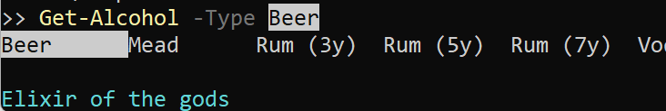

---
title: Tab Completion: Basics
---
# Basics
## Synopsis

Covers the basics of implementing custom tab expansion.

## Description
### The Order of Things

Custom tab completion in PSFramework consists of two steps:

 - Declaring and naming a scriptblock. The scriptblock will return all strings the user might want to complete to.
 - Assigning the named scriptblock to the parameter of a command.

For both there are commands provided by the module.

### Declaring a Scriptblock

All you really need for this to work is a name and a scriptblock:

```powershell
# Create scriptblock that collects information and name it
Register-PSFTeppScriptblock -Name "mymodule.alcohol" -ScriptBlock {
    'Beer', 'Mead', 'Whiskey', 'Wine', 'Vodka', 'Rum (3y)', 'Rum (5y)', 'Rum (7y)'
}
```

The scriptblock could execute any arbitrary piece of code, such as looking up active directory, perform SQL queries.
The scriptblock will _not_ be executed within the scope of the module declaring it!

To execute code within the scope of your module, you need to invoke it in that module:

```powershell
Register-PSFTeppScriptblock -Name "mymodule.beerlabel" -ScriptBlock {
    $module = Get-Module MyModule
    & $module { $script:Fridge.Label | Select-Object -Unique }
}
```

> You do not need to handle what the user already typed before completing - the system is handling this for you.

### Assigning a Scriptblock

To assign the scriptblock, three things are needed:

 - Name of the command that has the parameter you want to complete.
 - Name of the parameter you want to complete.
 - Name of the scriptblock you previously defined.

```powershell
# Assign scriptblock to function
Register-PSFTeppArgumentCompleter -Command Get-Alcohol -Parameter Type -Name "mymodule.alcohol"
```

> Nothing in this claims you can only provide custom tab completion only for your own commands! You can update tab completion for commands in other modules. This allows using this system in your profile to customize tab completion to your environment (for example to auto-populate the list of Hyper-V hosts to connect to).

### Adding Tooltips

Starting with version 1.7.237, `PSFramework` now supports adding tooltips to your tab completion.
Tooltips provide additional help to the user without impacting the tab completion core behavior.
For example, imagine providing tab completion to a parameter requiring a unique ID, and not the more convenient display name - with the tooltip feature, you can still show the user what they are selecting!

This requires little in the way of change, only that the scriptblock needs to return information slightly differently:

```powershell
# Create scriptblock that collects information and name it
Register-PSFTeppScriptblock -Name "mymodule.alcohol" -ScriptBlock {
    @{ Text = 'Beer'; ToolTip = 'Elixir of the gods'}
    @{ Text = 'Mead'; ToolTip = 'Elixir of the angry gods' }
    @{ Text = 'Whiskey'; ToolTip = 'Unleash the Irishman in you!' }
    @{ Text = 'Wine'; ToolTip = 'For the discriminating somelier' }
    @{ Text = 'Vodka'; ToolTip = 'Melancholy as national culture' }
    @{ Text = 'Rum (3y)'; ToolTip = 'Barkeepers Delight' }
    @{ Text = 'Rum (5y)'; ToolTip = 'Barkeepers Delight' }
    @{ Text = 'Rum (7y)'; ToolTip = 'Barkeepers Delight' }
}
```

In other words, so long as your return objects contain a "Text" and "ToolTip" key/property, they will be picked up:



### Module Design Advice

When implementing this in your module, there are three main ways to distribute your code.
No matter which you choose in the end, you should pick one mode and stick with it for your entire project.

> Function Driven

Maintain the scriptblock definitions in their own, individual files, in their own folder.
When compiling your module into a single file - if you do so - be sure to place them above the function definitions.
If you do not compile your module into a single file, still make sure to have them executed before loading your commands.

Maintain and execute your assignments right below the commands you are assigning them to.

This makes it easy to see all aspects of a function within the file containing the function, while still being able to assign the same scriptblock multiple times.

> Function Defined

Maintain both scriptblock definition & assignment in the same file the function completed for is stored.

This is the easiest way to maintain the added complexity within your module.
However it makes it a lot harder to reuse scriptblocks and thus is not recommended if you make extensive use of this feature.
Use with care and on lower scale implementations only.

> Structure Driven

Maintain both scriptblock definition and assignment separate from each other and from the command.

This is the recommended path if you make extensive use of custom tab completion and structure your module by the type of resource implemented.

### Scriptblock Implementation Notes

There are more advanced topics to help building your scriptblock:

 - You can access [what the user typed so far](typed-so-far.html). You do not need to locally prefilter your output - the system handles that for you - but you can include it in search filters if you need to perform remote queries.
 - You can access the [parameters already bound](previous-parameters.html) in order to react to input.
 - You have access to the [command called](calling-command.html) or the [parameter completed for](called-parameter.html).
 - For real fun deep-dives into the PowerShell Ast, you can parse [the current Ast](accessing-the-ast.html), opening the door to new realms of technical possibilities (and headaches; you have been warned!). For example, this would allow you to react to the bound parameters on the previous command in the pipeline.

## Notes
[Back to Tab Expansion](https://psframework.org/documentation/documents/psframework/tab-completion.html)

| Version | 2.0 |
| Written on: | 2018-06-18 |
| Updated on: | 2022-06-15 |