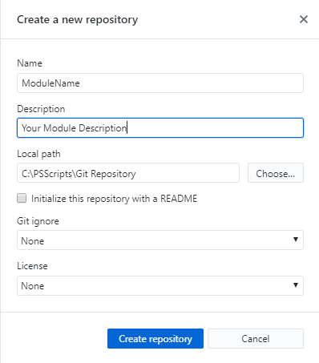
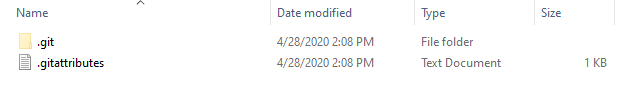

	1. Create a local Repository Example c:\PsScriipts\Repository
	2. Install GitHub Desktop from here: https://desktop.github.com/
	3. In GitHub Desktop click File | Create a new repository

NOTE: Directory must not already exist! If you have pre-created a directory for your code GitHub will throw an error.

Once GitHub creates your new module directory this is what it will look like.

	4. Open a new PS window
	5. Change directory to that folder "C:\PSScripts\Git Repository\ModuleName" | cd
	6. Run imt PSFProject -nofolder

NOTE: imt is an alias for Invoke-PSMDTemplate. Using the -nofolder will skip the folder creation because the folder has already been created by GitHub Desktop

	7. Enter value for parameter 'name': ModuleName
	8. Enter value for parameter 'description': Test Module

This is output in the directory you will see after you create your new template. This will be used for submitting to AzureDevOps for validation testing.

	

	9. In explorer go up one directory to your Repositor and right click on your Test module folder and open in your programming application (VS Code, Visual Studio, etc.)
	
NOTE: Develop away until you have all of your code the way you want it. Since GitHub desktop is already connected to that path it will auto update. Once you are finished with your code for the time being you can publish to your Git Hub Repository.

